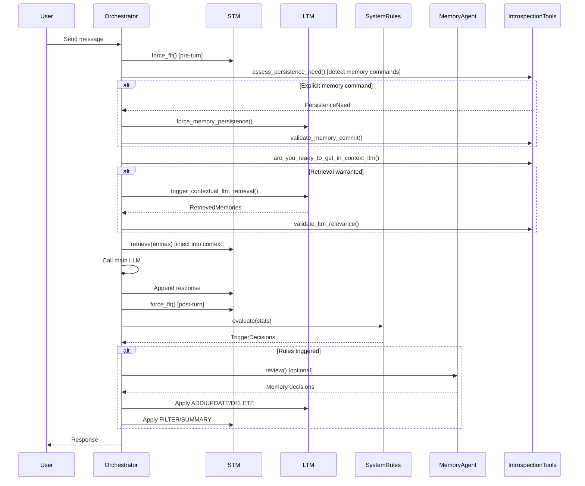

# Architecture & Design

## High-Level Architecture

```
┌─────────────────────────────────────────────────────────────────┐
│                         Orchestrator                            │
│  ┌──────────────┐  ┌─────────────────┐  ┌──────────────────┐   │
│  │ System Rules │  │  Memory Agent   │  │ Learning Scorer  │   │
│  │ (pure logic) │  │  (LLM-driven)   │  │ (self-assessed)  │   │
│  └──────┬───────┘  └────────┬────────┘  └────────┬─────────┘   │
│         │                   │                     │             │
│  ┌──────▼───────────────────▼─────────────────────▼─────────┐  │
│  │                    STM Context Window                      │  │
│  │         FILTER · SUMMARY · RETRIEVE · force_fit           │  │
│  └───────────────────────────┬───────────────────────────────┘  │
│                               │ promote / retrieve               │
│  ┌────────────────────────────▼──────────────────────────────┐  │
│  │                      LTM Store                             │  │
│  │     ADD · UPDATE · DELETE · SEARCH (semantic + overlap)    │  │
│  │     sqlite-vec vector index  ·  JSON persistence           │  │
│  └────────────────────────────────────────────────────────────┘  │
│                               │                                  │
│  ┌────────────────────────────▼──────────────────────────────┐  │
│  │              LTM Self-Introspection Toolkit                │  │
│  │    Agent-directed retrieval, validation, and persistence   │  │
│  └────────────────────────────────────────────────────────────┘  │
└─────────────────────────────────────────────────────────────────┘
```

## Three-Layer Control System

AgeMem uses a hybrid control architecture that compensates for the lack of RL training:

### Layer 1: System Rules (Deterministic)

Zero LLM cost. A pure rule engine fires memory operations based on measurable thresholds.

| Rule | ID | Trigger | Action |
|------|-----|---------|--------|
| Overflow Warning | R1 | utilisation >= 75% | Force SUMMARY |
| Overflow Critical | R2 | utilisation >= 90% | Force FILTER + SUMMARY |
| Periodic Review | R3 | Every N turns | Invoke MemoryAgent |
| Learning Spike | R4 | score >= 0.8 | Immediate LTM candidacy |

Location: [triggers/system_rules.py](../../triggers/system_rules.py)

### Layer 2: Memory Agent (LLM-Driven)

A dedicated sub-agent handles qualitative decisions:
- What content is worth storing in LTM
- Which context messages are low-relevance
- Whether compression is warranted

Triggered by the rule engine, not on every turn, keeping inference cost bounded.

Location: [agents/memory_agent.py](../../agents/memory_agent.py)

### Layer 3: Learning Score (Self-Assessed)

After every N turns, the main agent rates its own output on a 0-1 novelty scale:

| Score Range | Interpretation |
|-------------|----------------|
| 1.0 | Explicit user preferences, permanent facts |
| 0.7 | Temporary operational state |
| 0.4 | Inferred goals without concrete parameters |
| 0.0 | Tool executions, procedural acknowledgments |

Scores above the promotion threshold (0.65) trigger LTM candidacy. Scores above the spike threshold (0.8) bypass the periodic cadence entirely.

Location: [agents/learning_scorer.py](../../agents/learning_scorer.py)

## LTM Self-Introspection Toolkit

A self-directed introspection system that enables the agent to reason about, orchestrate, and validate its own long-term memory retrieval and persistence. Rather than relying solely on automatic triggers, the agent calls explicit tools to manage memory.

### Tool Organization (5 Tiers)

**Tier 1 — State Assessment (Introspection)**

Tools for the agent to evaluate its own state before acting:
- `assess_conversation_drift` — Detect topic drift from conversation anchor
- `self_assess_confidence` — Evaluate confidence in current context
- `are_you_ready_to_get_in_context_ltm` — Pre-flight check combining drift and confidence

**Tier 2 — Retrieval Orchestration (Action)**

Tools for executing retrieval with control:
- `paraphrase_for_coverage` — Generate semantic variants for better search coverage
- `trigger_contextual_ltm_retrieval` — Execute retrieval with mode selection (single_query, multi_paraphrase, anchored)

**Tier 3 — Validation & Refinement (Quality Control)**

Tools for ensuring retrieval quality:
- `validate_ltm_relevance` — Validate retrieved memories for relevance, groundedness, faithfulness
- `refine_retrieval_target` — Generate refined query strategy after validation failure
- `compress_conversation_for_ltm` — Compress context for LTM storage

**Tier 4 — Meta-Cognitive Tools (Learning)**

Tools for learning from retrieval decisions:
- `log_retrieval_decision` — Record decision chain for policy calibration
- `suggest_retrieval_strategy` — Recommend strategy based on conversation profile

**Tier 5 — Persistence Assurance (Memory Integrity)**

Tools for explicit memory commands:
- `assess_persistence_need` — Detect explicit memory commands ("remember that...", "store this...")
- `force_memory_persistence` — Bypass gating for immediate persistence
- `validate_memory_commit` — Confirm persistence succeeded (prevents "agent lies about recording" bug)
- `log_persistence_failure` — Capture failure details for debugging

Location:
- [memory/ltm_introspection.py](../../memory/ltm_introspection.py) — Implementation
- [memory/ltm_introspection_tools.py](../../memory/ltm_introspection_tools.py) — OpenAI-compatible tool definitions
- [memory/ltm_introspection_types.py](../../memory/ltm_introspection_types.py) — Type definitions

### Decision Chains

Every retrieval event produces a traceable chain:
```
signal fired → assessment → retrieval → validation → utility observed
```

Every persistence event produces a traceable chain:
```
user request → pattern detection → persistence → validation → confirmation
```

## Two-Stage Retrieval Pipeline

LTM semantic search uses a two-stage pipeline that balances semantic quality with temporal relevance.

### Stage 1: Semantic Broad-Pass

Query the vector index for candidate entries using sqlite-vec cosine similarity. Fetches `top_k * 3` candidates for re-ranking.

### Stage 2: Recency-Decay Re-Rank

Re-score candidates using weighted combination:
```
final_score = semantic_similarity * 0.5 + learning_score * 0.3 + recency_factor * 0.2
recency_factor = exp(-age_days * decay_rate)
```

### Retrieval Helpers

- `retrieve_by_tags()` — Tag-based filtering without semantic search
- `retrieve_recent()` — Recent entries sorted by update time

Location: [memory/retrieval.py](../../memory/retrieval.py)

## Document Ingestion Pipeline

AgeMem includes a document processing pipeline for converting external documents into searchable corpus entries.

### PDF Processing

- Uses [Docling](https://github.com/DS4SD/docling) for PDF-to-markdown conversion
- Automatic OCR detection for scanned PDFs (via PyMuPDF)
- Table structure recognition (FAST or ACCURATE mode)
- GLiNER-based named entity extraction with zero-shot NER

### Entity Extraction

Built-in label sets for different domains:
- `edilizia` — Italian construction and public tenders
- `research` — Scientific papers and academic publications
- `legal` — Legal documents and contracts

Custom label configurations via YAML files.

### Output Format

Each ingested document becomes a markdown file with YAML frontmatter containing:
- Document identity (doc_id, title, type, source_hash)
- Extracted entities organized by category
- Structural metadata (sections, page count, tables, figures)

### Usage

```bash
# Single PDF
python -m ingest.ingest report.pdf --labels research

# Markdown file
python -m ingest.ingest notes.md --labels research

# Directory batch
python -m ingest.ingest documents/ --labels edilizia
```

Location: [ingest/ingest.py](../../ingest/ingest.py)

## Prompt Registry System

Versioned prompt management with active version tracking and audit trails.

### Features

- Semantic versioning for prompts
- Active version selection
- Prompt metadata (author, tags, timestamps)
- Hot-reload support

### Usage

```python
from prompts.registry import PromptRegistry

registry = PromptRegistry()
prompt = registry.get_prompt("main-system")
registry.activate_version("main-system", "2.0.0")
```

Location: [prompts/registry.py](../../prompts/registry.py)

## Turn Lifecycle



## Critical Invariants

### 1. Double-Boundary Overflow Guard

Context must be within bounds at the **end** of every turn, not just the start.

```python
# Pre-turn: guarantee space for incoming user message
stm.force_fit()

# ... LLM call ...

# Post-turn: guarantee space for assistant response
stm.force_fit()
```

### 2. Pinned Message Protection

Messages marked `is_pinned=True` are never evicted under any pressure level. This includes:
- System prompt
- Retrieved LTM entries (marked as context injection)

### 3. Tool Call Deduplication

The `LoopGuard` pattern prevents duplicate tool calls with same arguments per turn:

```python
class ToolCallTracker:
    def record(self, call: ToolCall) -> bool:
        """Returns True if this is a duplicate."""
```

### 4. Persistence Guarantees

- LTM persists to disk on every write
- STM persists after every turn
- Both stored in `agent_memory/` directory for coherence

### 5. Persistence Validation

Before confirming to the user that something was remembered, the agent must:
1. Call `force_memory_persistence()` to actually persist
2. Call `validate_memory_commit()` to verify success
3. Only then confirm to the user

This prevents the "agent claims to remember but didn't actually persist" bug.

## Data Contracts

All core types are defined in [core/types.py](../../core/types.py):

### MemoryEntry

```python
@dataclass
class MemoryEntry:
    content: str
    entry_id: str           # SHA1 hash, auto-generated
    created_at: float       # Unix timestamp
    updated_at: float
    access_count: int       # Incremented on retrieval
    learning_score: float   # Aggregated from LearningFeedback
    tags: list[str]
    source_turn: int        # Which turn created this entry
```

### ContextMessage

```python
@dataclass
class ContextMessage:
    role: str               # "system" | "user" | "assistant" | "tool"
    content: Optional[str]
    turn_index: int
    token_estimate: int
    relevance_score: float  # Used by FILTER to rank eviction priority
    is_pinned: bool         # Never evicted if True
    tool_call_id: Optional[str]
    tool_calls: Optional[list[dict]]
```

### LearningFeedback

```python
@dataclass
class LearningFeedback:
    score: float            # 0.0 - 1.0
    rationale: str
    turn_index: int
    affected_content: str   # Verbatim excerpt worth remembering
```

## Directory Structure

```
.
├── core/
│   ├── types.py            # Data contracts
│   ├── config.py           # All tunable thresholds
│   ├── tracing.py          # OpenTelemetry tracing
│   ├── json_utils.py       # JSON parsing utilities
│   └── db_migrations.py    # SQLite schema migrations
├── memory/
│   ├── ltm_store.py        # LTM: ADD/UPDATE/DELETE/SEARCH
│   ├── stm_context.py      # STM: FILTER/SUMMARY/force_fit
│   ├── embedding.py        # Qwen3-Embedding-0.6B wrapper
│   ├── vector_index.py     # sqlite-vec integration
│   ├── context_retrieval.py # Context-aware retrieval
│   ├── retrieval.py        # Two-stage semantic search
│   ├── ltm_introspection.py    # Self-management toolkit
│   ├── ltm_introspection_tools.py # Tool definitions
│   ├── ltm_introspection_types.py # Type definitions
│   └── migrations.py       # Memory schema migrations
├── triggers/
│   └── system_rules.py     # R1-R4 rule engine
├── agents/
│   ├── orchestrator.py     # Turn coordinator
│   ├── llm_client.py       # OpenAI-compatible wrapper
│   ├── memory_agent.py     # LTM decision agent
│   ├── learning_scorer.py  # Self-assessment feedback
│   └── response_handler.py # LLM response processing
├── tools/
│   ├── query_expansion.py  # Paraphrase generation
│   ├── web_tools.py        # Web search integration
│   ├── corpus.py           # Document corpus tools
│   └── tool_registry.py    # Tool registration
├── skills/
│   ├── loader.py           # Skill loading from corpus
│   └── manager.py          # Skill detection/injection
├── prompts/
│   ├── registry.py         # Prompt version management
│   └── loader.py           # Prompt loading utilities
├── ingest/
│   ├── ingest.py           # PDF-to-markdown pipeline
│   └── gliner_labels/      # NER label configurations
├── agent_memory/           # Persistence directory
│   ├── ltm_store.json      # LTM entries backup
│   ├── ltm_semantic.db     # SQLite with vector index
│   └── stm_context.json    # STM snapshot
└── tests/
    └── test_*.py           # 18 unit test files
```

## Design Patterns Used

| Pattern | Location | Purpose |
|---------|----------|---------|
| Singleton | `AgememConfig.DEFAULT_CONFIG` | Shared configuration instance |
| Strategy | `LTMStore.search()` | Pluggable retrieval (semantic vs overlap) |
| Observer | `SystemRules.evaluate()` | Rule-based trigger system |
| Template Method | `Orchestrator.chat()` | Turn lifecycle with extension points |
| Guard/LoopGuard | `ToolCallTracker` | Duplicate prevention |
| Thread-Local State | `_IntrospectionState` | Per-session introspection state |

## Schema Migrations

SQLite schema management for semantic search features.

### Functions

- `apply_semantic_schema(db_path)` — Create tables, columns, vector index
- `verify_semantic_schema(db_path)` — Check schema readiness
- `drop_semantic_schema(db_path)` — Remove vector schema (with data preservation option)

### Schema Components

- `ltm_entries` table — Memory entries with embedding columns
- `ltm_vec_index` virtual table — sqlite-vec vector index

Location: [core/db_migrations.py](../../core/db_migrations.py)