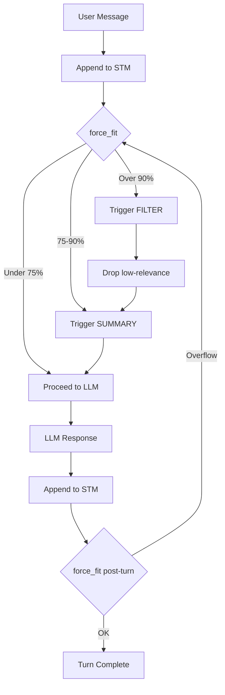

# Memory System Deep Dive

## Overview

AgeMem implements a two-tier memory architecture:

```
┌─────────────────────────────────────────────────────────────┐
│                    Short-Term Memory (STM)                  │
│                                                             │
│   Active context window — filtered, summarised, managed     │
│   Location: {PERSIST_DIR}/stm_context.json                  │
│                                                             │
└──────────────────────────┬──────────────────────────────────┘
                           │ promote (learning_score >= threshold)
                           │ retrieve (semantic search)
                           ▼
┌─────────────────────────────────────────────────────────────┐
│                    Long-Term Memory (LTM)                   │
│                                                             │
│   Persistent knowledge store — semantic retrieval           │
│   Location: {PERSIST_DIR}/ltm_store.json                    │
│   Vector DB: {PERSIST_DIR}/ltm_semantic.db                  │
│                                                             │
└─────────────────────────────────────────────────────────────┘
```

---

## Long-Term Memory (LTM)

### Core Operations

| Operation | Trigger | Effect |
|-----------|---------|--------|
| ADD | Learning score >= 0.65 or MemoryAgent decision | Store new entry |
| UPDATE | Similar content exists + new information | Overwrite existing entry |
| DELETE | MemoryAgent decision or manual | Remove entry |
| SEARCH | Every user query | Retrieve relevant entries |
| PRUNE | Entry count > LTM_MAX_ENTRIES | Drop lowest-scored entries |

### Storage Schema

```python
@dataclass
class MemoryEntry:
    content: str              # The actual memory content
    entry_id: str             # SHA1 hash (auto-generated)
    created_at: float         # Unix timestamp
    updated_at: float         # Last modification time
    access_count: int         # Times retrieved
    learning_score: float     # Aggregated novelty signal
    tags: list[str]           # User/agent assigned tags
    source_turn: int          # Conversation turn origin
```

### Retrieval Methods

#### Semantic Search (Default)

When `ENABLE_SEMANTIC_SEARCH=true`, uses vector embeddings:

```python
# Hybrid scoring formula
score = 0.60 × cosine_similarity    # Semantic relevance
      + 0.25 × recency_decay        # Time-based decay
      + 0.15 × learning_score       # Importance weight
```

**Model**: `Qwen/Qwen3-Embedding-0.6B` (1024 dimensions)

**Vector Store**: `sqlite-vec` for efficient similarity search

#### Overlap Fallback

When semantic search is disabled, uses token-based Jaccard similarity:

```python
def jaccard_similarity(query_tokens: set, entry_tokens: set) -> float:
    intersection = len(query_tokens & entry_tokens)
    union = len(query_tokens | entry_tokens)
    return intersection / union if union > 0 else 0.0
```

Threshold: `LTM_DEDUP_OVERLAP_THRESHOLD=0.7`

### Deduplication

Prevents storing near-identical memories:

| Mode | Method | Threshold |
|------|--------|-----------|
| Semantic | Cosine similarity | 0.92 |
| Overlap | Jaccard similarity | 0.70 |

When a duplicate is detected, the existing entry is updated instead of creating a new one.

### Context-Aware Retrieval

When `CONTEXT_AWARE_RETRIEVAL=true`, queries are enriched with conversation context:

```python
# Weight configuration
CONTEXT_CURRENT_QUERY_WEIGHT = 0.50
CONTEXT_PREVIOUS_TURN_WEIGHT = 0.30
CONTEXT_TURN_BEFORE_WEIGHT = 0.15
CONTEXT_OLDEST_TURN_WEIGHT = 0.05

# Context window size
CONTEXT_WINDOW_SIZE = 3  # Turns to consider
```

This helps retrieve memories relevant to the ongoing conversation, not just the current query.

---

## Short-Term Memory (STM)

### Core Operations

| Operation | Trigger | Effect |
|-----------|---------|--------|
| RETRIEVE | LTM search results | Inject memories into context |
| FILTER | Critical overflow (>= 90%) | Drop low-relevance messages |
| SUMMARY | Warning overflow (>= 75%) | Compress message window |
| force_fit | Every turn (pre/post) | Ensure context within limits |

### Context Window Management

```python
class STMContext:
    def force_fit(self) -> list[MemoryOpResult]:
        """
        Guarantee context is within STM_TOKEN_LIMIT.

        Priority order:
        1. Never drop pinned messages
        2. Drop lowest relevance_score first
        3. Keep minimum STM_MIN_MESSAGES
        4. Trigger SUMMARY if still over limit
        """
```

### Token Estimation

AgeMem uses a heuristic when `tiktoken` is unavailable:

```python
def count(self, text: str) -> int:
    # ~0.75 tokens per word + 4 framing overhead
    words = len(text.split())
    return max(1, int(words * 0.75)) + 4
```

For accurate counts, provide a tiktoken encoder:

```python
from tiktoken import encoding_for_model
encoder = encoding_for_model("gpt-4o")
counter = TokenCounter(encoder)
```

### Message Flow



### Pinned Message Protection

Messages with `is_pinned=True` are never evicted:

```python
# System prompt (always pinned)
system_msg = ContextMessage(
    role="system",
    content=system_prompt,
    is_pinned=True
)

# Retrieved LTM entries (pinned during injection)
ltm_msg = ContextMessage(
    role="system",
    content=f"[Memory] {entry.content}",
    is_pinned=True
)
```

---

## Memory Promotion Flow

### Learning Score Collection

Every `LEARNING_SCORE_PROMPT_EVERY_N` turns (default: 3), the agent self-assesses:

```python
_LEARNING_PROMPT = """
Analyze the interaction and return JSON:
{
  "score": <float>,      // 0.0 - 1.0
  "rationale": "<string>",
  "affected_content": "<string>"  // Verbatim excerpt if score >= 0.7
}

Scoring matrix:
- 1.0: Explicit user preferences, permanent facts
- 0.7: Temporary operational state
- 0.4: Inferred goals without concrete parameters
- 0.0: Tool executions, procedural acknowledgments
"""
```

### Promotion Thresholds

| Score | Action |
|-------|--------|
| >= 0.8 | Immediate LTM ADD (bypass cadence) |
| >= 0.65 | LTM ADD candidate (normal flow) |
| <= 0.30 | FILTER candidate (low relevance) |

### Memory Agent Review

When triggered (periodic or learning spike), the MemoryAgent decides:

```python
{
  "ltm_operations": [
    {"op": "add", "content": "...", "tags": ["..."], "confidence": 0.9},
    {"op": "update", "entry_id": "...", "content": "..."},
    {"op": "delete", "entry_id": "..."}
  ],
  "context_relevance": [
    {"turn_index": 5, "relevance_score": 0.2}  // Low relevance
  ],
  "summary_needed": false,
  "rationale": "..."
}
```

---

## Query Expansion

When `ENABLE_QUERY_EXPANSION=true`, generates paraphrase variants:

```python
# Configuration
QUERY_EXPANSION_N_VARIANTS = 3  # Original + 2 variants
QUERY_EXPANSION_USE_NER_HINTS = True  # Use entity extraction
QUERY_EXPANSION_TIMEOUT_MS = 2000  # LLM timeout
```

### Fallback Transforms

When LLM is unavailable, uses regex-based transforms:

- `nominalize`: "how to fix" → "fixing methods"
- `add_how_to`: "memory management" → "how to manage memory"

---

## Persistence

### File Locations

```
{PERSIST_DIR}/
├── ltm_store.json      # All LTM entries
├── stm_context.json    # Current context state
└── ltm_semantic.db     # Vector index (if semantic search enabled)
```

### Persistence Guarantees

1. **LTM**: Persisted on every write (ADD/UPDATE/DELETE)
2. **STM**: Persisted after every turn
3. **Atomic**: Uses temp file + rename for crash safety

### Loading on Startup

```python
# LTMStore loads from disk on initialization
ltm = LTMStore(
    persist_path=Path("agent_memory/ltm_store.json"),
    semantic_db_path=Path("agent_memory/ltm_semantic.db"),
    enable_semantic_search=True
)

# STMContext loads from disk on initialization
stm = STMContext(
    persist_path=Path("agent_memory/stm_context.json")
)
```

---

## Introspection API

LTM provides self-management tools:

```python
# Health assessment
assessment = ltm.assess_health()

# Topic drift detection
drift = ltm.detect_topic_drift(recent_queries)

# Confidence scoring
confidence = ltm.estimate_confidence(query)

# Compression recommendations
recommendation = ltm.recommend_compression()
```

See [memory/ltm_introspection.py](../../memory/ltm_introspection.py) for full API.